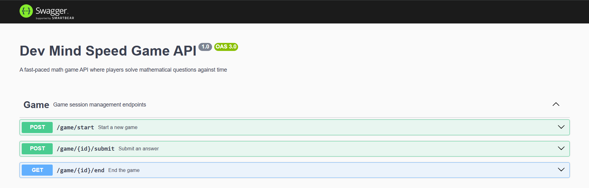

# Dev Mind Speed Game API

A fast-paced mathematical game API built with NestJS where players solve math equations against time. Challenge yourself with different difficulty levels and track your performance!

## 🚀 Features

- **Real-time Math Game**: Solve mathematical equations under time pressure
- **Multiple Difficulty Levels**: 4 difficulty levels from basic arithmetic to complex calculations
- **Performance Tracking**: Track your best scores, response times, and game history
- **RESTful API**: Clean and well-documented API endpoints
- **Swagger Documentation**: Interactive API documentation available at `/api/v1`
- **TypeScript**: Full type safety and modern development experience

## 🛠️ Technology Stack

- **Framework**: NestJS
- **Database**: MySQL with TypeORM
- **Language**: TypeScript
- **Documentation**: Swagger/OpenAPI
- **Validation**: Class Validator & Class Transformer
- **Math Engine**: Math.js for equation evaluation

## 📋 Prerequisites

Before you begin, ensure you have the following installed on your system:

- **Node.js** (version 18.0 or higher) - [Download here](https://nodejs.org/)
- **npm** (comes with Node.js)
- **MySQL** (version 8.0 or higher) - [Download here](https://dev.mysql.com/downloads/mysql/)
- **Git** - [Download here](https://git-scm.com/downloads)

## 🗄️ Database Setup

### 1. Install MySQL

**Windows:**

1. Download MySQL Installer from [MySQL Downloads](https://dev.mysql.com/downloads/mysql/)
2. Run the installer and choose "Developer Default"
3. Follow the installation wizard
4. Set a root password (remember this!)

### 2. Create Database

Connect to MySQL and create the database:

```sql
-- Connect to MySQL as root
mysql -u root -p

-- Create database
CREATE DATABASE dev_mind_speed;

-- Create a user for the application (optional but recommended)
CREATE USER 'user'@'localhost' IDENTIFIED BY 'your_secure_password';
GRANT ALL PRIVILEGES ON dev_mind_speed.* TO 'user'@'localhost';
FLUSH PRIVILEGES;

-- Exit MySQL
EXIT;
```

## 🔧 Installation & Setup

### 1. Clone the Repository

```bash
git clone https://github.com/sakhreyah/Dev-Mind-Speed.git
cd Dev-Mind-Speed
```

### 2. Install Dependencies

```bash
# Using npm
npm install
```

### 3. Environment Configuration

Create a `.env` file in the root directory and add the following environment variables:

```env
# Application Configuration
PORT=3000

# Database Configuration
DB_HOST=localhost
DB_PORT=3306
DB_USERNAME=user
DB_PASSWORD=your_secure_password
DB_DATABASE=dev_mind_speed

```

### 4. Database Migration

The application uses TypeORM with synchronization enabled for development. The database tables will be created automatically when you start the application.

**⚠️ Important**: In production, set `synchronize: false` in `src/app.module.ts` and use proper migrations.

### 5. Verify Configuration

Test your database connection:

```bash
# This will attempt to connect to the database
npm run start:dev
```

If successful, you should see:

```
[Nest] LOG [InstanceLoader] TypeOrmModule dependencies initialized
[Nest] LOG [NestApplication] Nest application successfully started
```

## 🚀 Running the Application

### Development Mode

```bash
# Start with hot reload
npm run start:dev

# Or with debugging
npm run start:debug
```

### Production Mode

```bash
# Build the application
npm run build

# Start in production mode
npm run start:prod
```

## 📚 API Documentation

Once the application is running, access the interactive API documentation:

- **Swagger UI**: http://localhost:3000/api/v1
- **Base API URL**: http://localhost:3000/api/v1



### 📮 Postman Collection

For easy API testing, we provide a Postman collection with pre-configured requests:

#### Import the Collection

1. **Download Postman**: If you don't have it, download from [getpostman.com](https://www.postman.com/downloads/)

2. **Import Collection**:
   - Open Postman
   - Click "Import" button (top left)
   - Select "Upload Files"
   - Choose `Dev Mind.postman_collection.json` from the project root
   - Click "Import"

#### Using the Collection

The collection includes three main requests:

1. **Start Game** (`POST /game/start`)
   - Creates a new game session
   - Returns game ID and first question
   - Copy the game ID from response for next requests

2. **Submit Answer** (`POST /api/v1/game/{id}/submit`)
   - Submit your answer to the current question
   - Replace `{id}` with the game ID from start game response
   - Returns next question or game completion status

3. **End Game** (`GET /api/v1/game/{id}/end`)
   - Ends the current game session
   - Returns final score and game statistics

#### Quick Test Flow

1. Send **Start Game** request with your name and difficulty level (1-4)
2. Copy the game ID from the response
3. Update the **Submit Answer** URL with your game ID
4. Submit answers until game ends
5. Use **End Game** to get final results

### Quick API Overview

| Endpoint                        | Method | Description              |
| ------------------------------- | ------ | ------------------------ |
| `POST /api/v1/game/start`       | POST   | Start a new game session |
| `POST /api/v1/game/{id}/submit` | POST   | Submit an answer         |
| `GET /api/v1/game/{id}/end`     | GET    | End game and get results |

## 🎮 How to Play

### 1. Start a Game

```bash
curl -X POST http://localhost:3000/api/v1/game/start \
  -H "Content-Type: application/json" \
  -d '{
    "name": "Musab Sakhreyah",
    "difficulty": 1
  }'
```

**Response:**

```json
{
  "message": "Hello Musab Sakhreyah, find your submit API URL below.",
  "submit_url": "http://localhost:3000/api/v1/game/123e4567-e89b-12d3-a456-426614174000/submit",
  "question": "7 + 3",
  "time_started": "2025-06-25T09:30:15.123Z"
}
```

### 2. Submit Answers

```bash
curl -X POST http://localhost:3000/api/v1/game/{game-id}/submit \
  -H "Content-Type: application/json" \
  -d '{
    "answer": 10
  }'
```

### 3. End Game

```bash
curl -X GET http://localhost:3000/api/v1/game/{game-id}/end
```

## 🎯 Difficulty Levels

| Level | Description | Numbers             | Operations         |
| ----- | ----------- | ------------------- | ------------------ |
| 1     | Beginner    | 1-digit (2 numbers) | Basic (+, -, ×, ÷) |
| 2     | Easy        | 2-digit (3 numbers) | Basic (+, -, ×, ÷) |
| 3     | Medium      | 3-digit (4 numbers) | Basic (+, -, ×, ÷) |
| 4     | Hard        | 4-digit (5 numbers) | Basic (+, -, ×, ÷) |

## 🏗️ Project Structure

```
src/
├── answers/          # Answer management module
├── base/             # Base entity with common fields
├── game/             # Game session management
├── questions/        # Question generation and storage
├── app.module.ts     # Main application module
└── main.ts          # Application entry point
```
